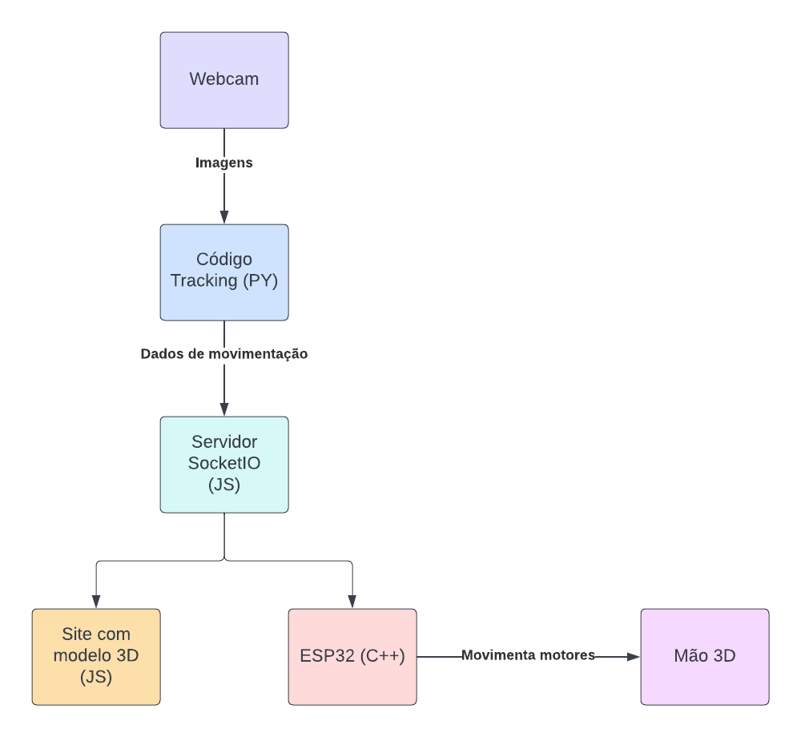
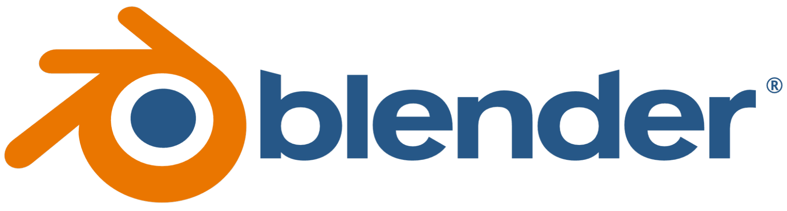
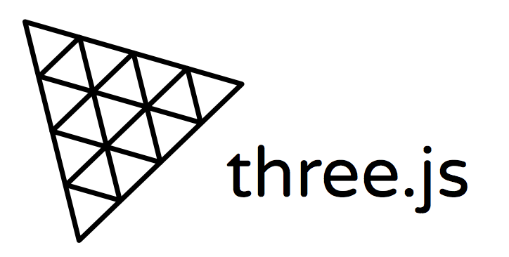
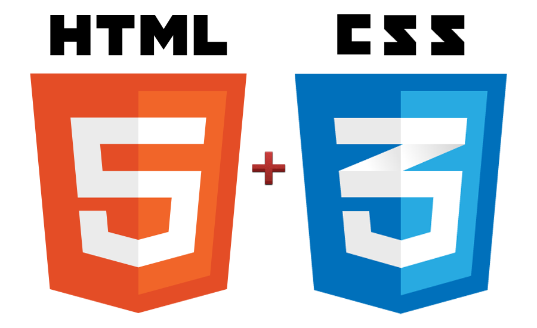
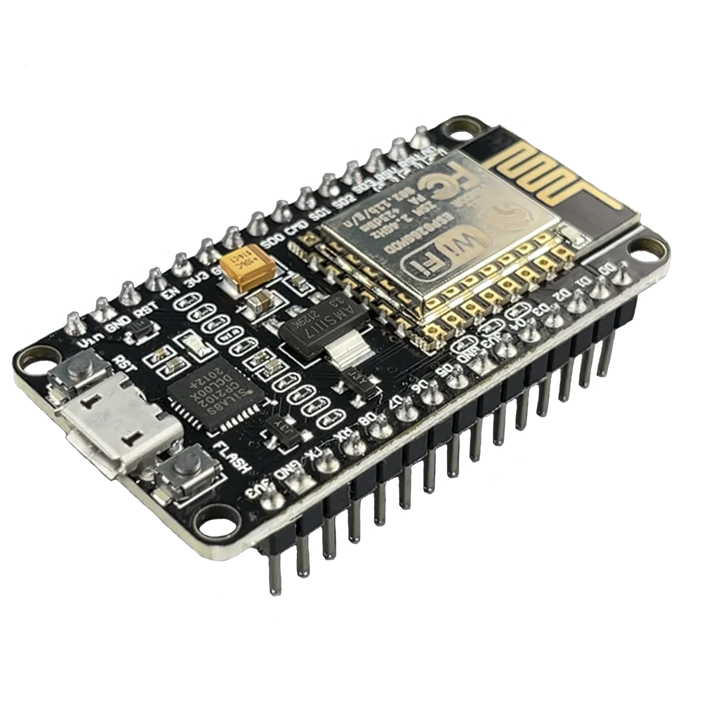
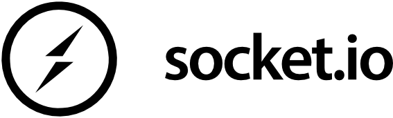
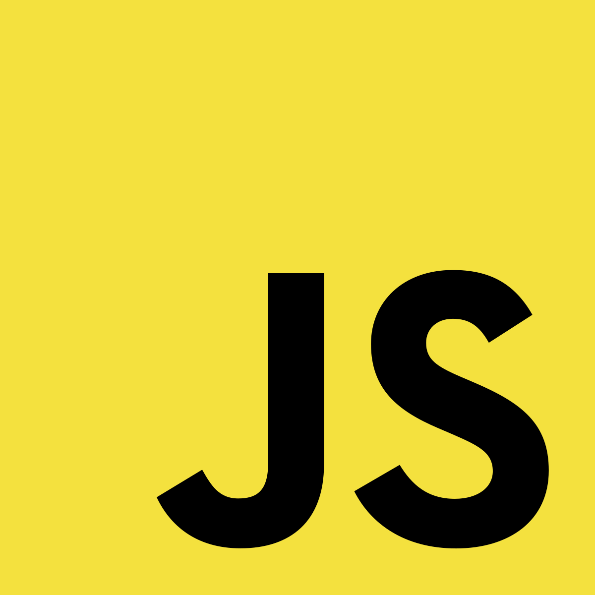
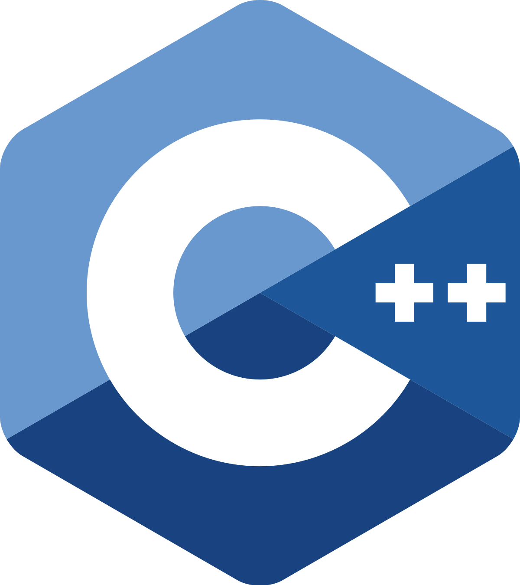

## Resumo
O projeto da mão robótica foi idealizado durante a aula de projeto integrado computação 2 - Hardware e Software. Onde nosso grupo definiu a ideia de construir uma mão mecânica, onde a mesma tem como objetivo, copiar o movimentos de uma mão real. A leitura da mão será feita utilizando uma inteligência artificial e os dados da leitura serão enviados via servidor para um microcontrolador e para um site que irá replicar o movimento em um modelo 3D.

## :information_source: Como usar

Para copiar e executar essa aplicação, você precisa de três pré-requisitos: [Git](https://git-scm.com), [Node.js][nodejs] + [Yarn][yarn] + [Python][python] intalados no seu computador.

No terminal, digite os comandos a seguir:

### Baixar e instalar o projeto

```bash
# Clonar esse repositório
$ git clone https://github.com/andreocunha/pic2_mao_robotica.git

# Vá para o ropositório
$ cd pic2_mao_robotica
```

### Executar o Servidor

```bash
# Execute em outro terminal (dentro da pasta pic2_mao_robotica/software/server)
# Instale as dependências
$ npm install
$ npm run dev
```

### Executar o reconhecimento da mão

```bash
# Execute em outro terminal (dentro da pasta pic2_mao_robotica/software/hand_tracking)
# Instale as dependências
$ pip3 install opencv-python
$ pip3 install mediapipe
$ pip3 install python-socketio

# Executar o código
$ python3 main.py
```

### Executar o site com modelo 3D
Apenas dê dois cliques no arquivo index.html

### Desenvolvimento

#### Processo de desenvolvimento


## :rocket: Tecnologias

Para o desenvolvimento deste projeto foram usadas diversas tecnologias para todas as diferentes funcionalidades, sendo para manusear objetos em 3D, comunicação e desenvolvimento front-end. Entre as tecnologias usadas, são elas:

## Blender



Blender é um programa de computador de código aberto, desenvolvido pela Blender Foundation, para modelagem, animação, texturização, composição, renderização, e edição de vídeo.
Este software foi utilizado para realizarmos a modelagem da mão que foi utilizada no site.


## Three.js



Three.js é uma biblioteca extremamente poderosa baseada em JavaScript/API cross-browser usada para criar e mostrar gráficos 3D animados em um navegador web. Three.js usa WebGL.
Esta biblioteca foi utilizada para conseguirmos manipular os movimentos do modelo da mão 3D em um website desenvolvido com HTML, CSS e Javascript.


## HTML e CSS



HTML é uma linguagem de marcação utilizada na construção de páginas na Web. Documentos HTML podem ser interpretados por navegadores. CSS é um mecanismo para adicionar estilo a um documento web.
Essas tecnologias foram utilizadas para desenvolver o site onde fica o modelo em 3D da mão, escolhidas por serem de fácil manuseio e simples de executar. 


## ESP8266



O ESP8266 é um micro chip Wi-Fi de baixo custo, com software de rede TCP/IP integrado e capacidade de microcontrolador, produzido pela Espressif Systems em Xangai, China.
Esse microchip foi utilizado para conseguirmos ter uma comunicação direta entre os motores servos que movimentam a mão robótica e o servidor que recebe os comandos via rede.


## Socket.io



Socket.io é uma implementação em node para websocket, ou seja, uma forma de fazer comunicação em tempo real, mas mais importante que isso é sua possibilidade de fallBack. Está disponível para iOS, Android, e linguagens de programação utilizadas em back-end e front-end. 
O Socket.IO funciona basicamente com dois métodos: o de emitir e o de escutar. Ambos sempre recebem dois parâmetros, o evento e os dados. 
Essa tecnologia foi utilizada para receber e enviar os dados necessários para a movimentação da mão robótica.


## MediaPipe


O MediaPipe é uma framework de inteligência artificial desenvolvida pela Google, onde a mesma possui diversas funcionalidades, sendo uma delas o processamento de imagens em tempo real. Ela possui diversas funcionalidades, mas a principal utilizada neste projeto para conseguirmos captar o movimento da mão e identificar seus movimentos para ser copiada para a mão robótica é a Handle Tracking.
Essa funcionalidade consegue fazer o acompanhamento da mão e dos dedos, realizando essa leitura através dos frames da imagem.


## Linguagens

Por se tratar de um projeto com muitas integrações, cada parte foi desenvolvida utilizando uma linguagem de programação. As linguagens utilizadas nesse projeto foram:

## Javascript



JavaScript é uma linguagem de programação interpretada estruturada, de script em alto nível com tipagem dinâmica fraca e multiparadigma. Juntamente com HTML e CSS, o JavaScript é uma das três principais tecnologias da World Wide Web.


## C++



C++ é uma linguagem de programação de uso geral criada pelo cientista da computação dinamarquês Bjarne Stroustrup como uma extensão da linguagem de programação C, ou "C com Classes".


## Python


Python é uma linguagem de programação de alto nível, interpretada e de propósito geral. Sua filosofia de design enfatiza a legibilidade do código com o uso de recuo significativo.


[nodejs]: https://nodejs.org/
[yarn]: https://yarnpkg.com/
[python]: https://www.python.org/
